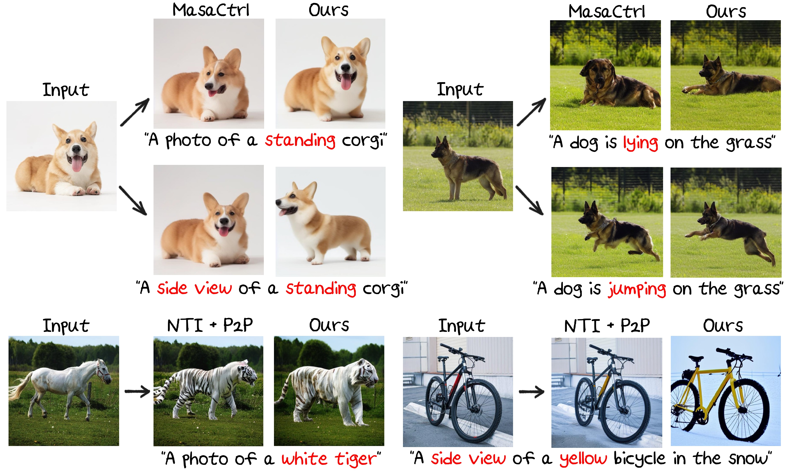

<p align="center">
  <h2 align="center"><strong>FlexiEdit:<br> Frequency-Aware Latent Refinement for <br> Enhanced Non-Rigid Editing</strong></h2>

<p align="center">
    <a href="https://kookie12.github.io/">Gwanhyeong Koo</a>,
    <a href="https://dbstjswo505.github.io/">Sunjae Yoon</a>,
    <a href="https://jiwoohong93.github.io/">Ji Woo Hong</a>,
    <a href="http://sanctusfactory.com/family.php">Chang D. Yoo</a>
    <br>
    <b>KAIST</b>
</p>


<div align="center">

<a href='https://arxiv.org/abs/2407.17850'></a> &nbsp;&nbsp;&nbsp;&nbsp;
<a href='https://kookie12.github.io/FlexiEdit-Project-Page/'></a> &nbsp;&nbsp;&nbsp;&nbsp;

</div>


<p align="center">
    
</p>

## Release
- [07/03] Initial Preview Release 🔥 Coming Soon!
- [09/07] Official Release of Code 🔥 Available Now!

## Contents
- [Release](#release)
- [Contents](#contents)
- [🐶 Introduction](#-introduction)
- [💻 Installation](#-installation)
- [🚀 Usage](#-usage)
- [📆 TODO](#-todo)
- [🙌🏻 Acknowledgement](#-acknowledgement)
- [📖 BibTeX](#-bibtex)

## 🐶 Introduction
Current image editing methods using DDIM Inversion face challenges with non-rigid edits due to high-frequency components in DDIM latent, which hinder structural changes. We introduce <font color="#1367a7"><b>FlexiEdit</b></font>, which improves fidelity to input text prompts by refining these components in targeted areas. FlexiEdit features Latent Refinement for layout adjustments and Edit Fidelity Enhancement for accurate text prompt reflection, demonstrating superior performance in complex edits through comparative experiments.


<!-- ## Examples -->

## 💻 Installation
It is recommended to run our code on a Nvidia GPU with a linux system. We have not yet tested on other configurations. Currently, it requires around 20 GB GPU memory to run our method. 

To install the required libraries, simply run the following command:
```
git clone https://github.com/kookie12/FlexiEdit.git
cd FlexiEdit
conda env create -f environment.yml
conda activate flexiedit
```


## 🚀 Usage
To start using FlexiEdit, execute the following commands:
```
python run_flexiedit.py
```

**Note**: Within `run_flexiedit.py`, you can set parameters such as `model_path`, `out_dir`, and `source_image_path`.

To use a user-defined mask for edits, obtain coordinates using `draw_bbox.py` and input them into `bbx_start_point` and `bbx_end_point`. If you prefer an automatic mask, simply set these values to None.

**Compatibility**: FlexiEdit has been primarily tested on Stable Diffusion versions v1-4, but is also compatible with newer versions like v1-5 and v2-1. You can download these checkpoints from their official repository.

## 📆 TODO
The repo is still being under construction, thanks for your patience. 
- [x] Release of code.


## 🙌🏻 Acknowledgement
Our code is based on these awesome repos:
* [Prompt-to-prompt](https://arxiv.org/abs/2208.01626), [Null-text Inversion](https://arxiv.org/abs/2211.09794) [[code](https://github.com/google/prompt-to-prompt)]
* [ProxEdit](https://arxiv.org/abs/2306.05414) [[code](https://github.com/phymhan/prompt-to-prompt?tab=readme-ov-file)]
* [MasaCtrl](https://arxiv.org/abs/2304.08465) [[code](https://github.com/TencentARC/MasaCtrl)]

## Acknowledgement (Funding)
This work was partly supported by Institute for Information & communications Technology Planning & Evaluation (IITP) grant funded by the Korea government(MSIT) (No. 2021-0-01381, Development of Causal AI through Video Understanding and Reinforcement Learning, and Its Applications to Real Environments) and partly supported by Institute of Information & communications Technology Planning & Evaluation (IITP) grant funded by the Korea government(MSIT) (No.2022-0-00184, Development and Study of AI Technologies to Inexpensively Conform to Evolving Policy on Ethics).

## 📖 BibTeX
If you find our repo helpful, please consider leaving a star or cite our paper :)
```bibtex
@article{koo2024flexiedit,
  title={FlexiEdit: Frequency-Aware Latent Refinement for Enhanced Non-Rigid Editing},
  author={Koo, Gwanhyeong and Yoon, Sunjae and Hong, Ji Woo and Yoo, Chang D},
  journal={arXiv preprint arXiv:2407.17850},
  year={2024}
}
```
