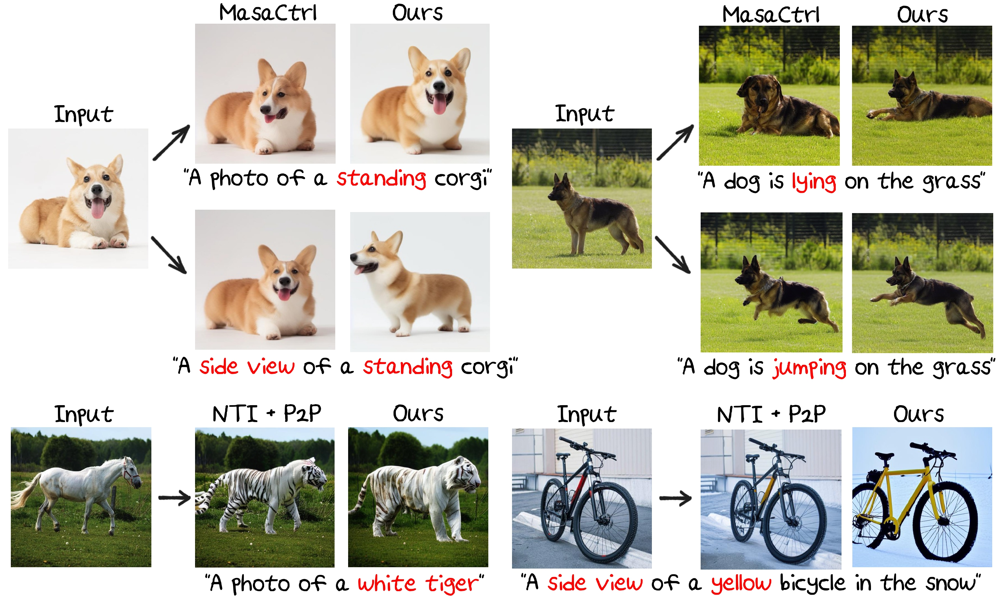

  <h2 align="center"><strong>FlexiEdit:  Frequency-Aware Latent Refinement for   Enhanced Non-Rigid Editing</strong></h2>

    <a href="https://kookie12.github.io/">Gwanhyeong Koo</a>,
    <a href="https://dbstjswo505.github.io/">Sunjae Yoon</a>,
    <a href="http://sanctusfactory.com/family_02.php">Ji Woo Hong</a>,
    <a href="http://sanctusfactory.com/family.php">Chang D. Yoo</a>
     
    <b>KAIST</b>

 &nbsp;&nbsp;&nbsp;&nbsp;
 &nbsp;&nbsp;&nbsp;&nbsp;

    

## Release
- [07/03] 🔥🔥 Comming Soon!

## Contents
- [Release](#release)
- [Contents](#contents)
- [Introduction](#introduction)
- [Examples](#examples)
- [Installation](#installation)
- [Useage](#useage)
- [TODO](#todo)
- [Acknowledgement](#acknowledgement)
- [BibTeX](#bibtex)

## Introduction
Current image editing methods using DDIM Inversion face challenges with non-rigid edits due to high-frequency components in DDIM latent, which hinder structural changes. We introduce <b>FlexiEdit</b>, which improves fidelity to input text prompts by refining these components in targeted areas. FlexiEdit features Latent Refinement for layout adjustments and Edit Fidelity Enhancement for accurate text prompt reflection, demonstrating superior performance in complex edits through comparative experiments.

## Examples

## Installation

## Useage

## TODO
The repo is still being under construction, thanks for your patience. 
- [ ] Release of code.

## Acknowledgement
Our code is based on these wonderful repos:
* [Prompt-to-prompt](https://arxiv.org/abs/2208.01626), [Null-text Inversion](https://arxiv.org/abs/2211.09794) [[code](https://github.com/google/prompt-to-prompt)]
* [ProxEdit](https://arxiv.org/abs/2306.05414) [[code](https://github.com/phymhan/prompt-to-prompt?tab=readme-ov-file)]
* [MasaCtrl](https://arxiv.org/abs/2304.08465) [[code](https://github.com/TencentARC/MasaCtrl)]

## BibTeX